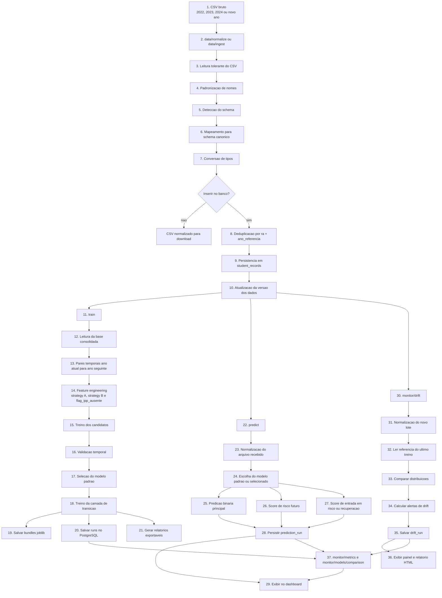
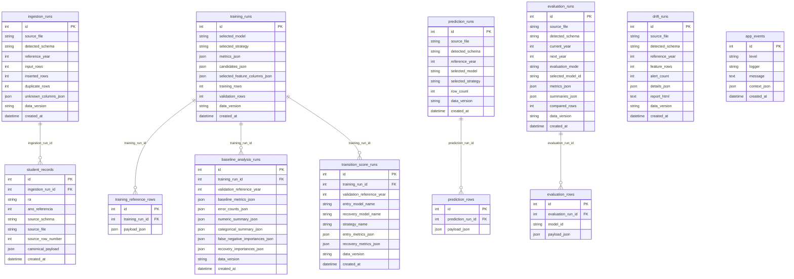

## 2. Arquitetura e Organização do Projeto

### 2.1. Princípio arquitetural

A solução foi organizada em três camadas:

- camada de entrada e exposição: FastAPI + dashboard
- camada de serviços: normalização, treino, predição, avaliação e monitoramento
- camada de persistência operacional: PostgreSQL

Os arquivos CSV continuam existindo como:

- dados brutos históricos do desafio
- formato de entrada para ingestão, predição, avaliação e drift

Depois da entrada do arquivo, a fonte de verdade operacional passa a ser o PostgreSQL. É dele que a aplicação consulta:

- base consolidada de estudantes
- histórico de ingestões
- execuções de treino
- predições
- avaliações
- drift
- eventos usados no dashboard

Os arquivos em `artifacts/` existem como exportações e materializações para auditoria, não como fonte primária da solução.

### 2.2. Estrutura do repositório

```text
datathon-entrega/
├── app/                                   # Expõe a API e o dashboard
│   ├── __init__.py
│   ├── main.py                            # Inicializa FastAPI, páginas HTML e endpoints de dados, treino, predição e monitoramento
│   ├── model/                             # Bundles serializados em joblib, incluindo o modelo padrão da API e os candidatos treinados
│   ├── static/
│   │   └── app.css                        # Layout, responsividade, tabelas, popovers e componentes visuais do dashboard
│   └── templates/
│       ├── base.html                      # Layout-base compartilhado por todas as páginas HTML
│       ├── dashboard_overview.html        # Visão geral executiva com métricas de treino, baseline e scores de transição
│       ├── dashboard_models.html          # Comparação entre baseline e modelos estatísticos
│       ├── dashboard_predict.html         # Upload de arquivo, escolha do modelo e leitura dos resultados de predição
│       ├── dashboard_drift.html           # Execução e leitura da análise de drift
│       ├── dashboard_logs.html            # Consulta dos eventos operacionais recentes
│       ├── dashboard_docs.html            # Swagger dentro do mesmo shell visual do dashboard
│       └── dashboard_markdown.html        # Renderização dos capítulos Markdown com tabelas, código e diagramas Mermaid
├── artifacts/                             # Guarda exportações técnicas geradas a partir do banco
│   ├── exports/
│   │   ├── predictions/
│   │   └── reports/
│   └── logs/
├── dados/                                 # Preserva os CSVs brutos originais
├── docs/
│   ├── chapters/
│   ├── 00_visao_geral_e_estrutura_do_projeto.md
│   ├── 01_referencia_de_arquivos_e_metodos.md
│   └── README.md                          # Índice rápido dos arquivos de documentação disponíveis
├── instrucoes/                            # PDF e textos originais do desafio
├── src/                                   # Concentra a lógica de negócio e a pipeline
│   ├── baseline_analysis.py               # Analisa os erros do baseline e gera sinais mais acionáveis para piora e melhora
│   ├── config.py                          # Caminhos do projeto, variáveis de ambiente e criação dos diretórios necessários
│   ├── dashboard_data.py                  # Consolida dados lidos do banco para visão geral, logs e comparações do dashboard
│   ├── database.py                        # Engine, sessões SQLAlchemy, criação das tabelas e registro de eventos operacionais
│   ├── db_models.py                       # Tabelas do PostgreSQL usadas pela aplicação
│   ├── feature_engineering.py             # Listas de variáveis usadas nas estratégias dos modelos
│   ├── modeling.py                        # Treino, comparação entre modelos, serialização dos bundles e predição
│   ├── monitoring.py                      # Referência do treino e análise de drift
│   ├── normalization.py                   # Transformação de CSV bruto para schema canônico interno
│   ├── schema_registry.py                 # Layouts conhecidos, aliases e regras de detecção do schema de entrada
│   ├── storage.py                         # Ingestão normalizada, deduplicação e consulta da base consolidada
│   ├── transition_scoring.py              # Scores complementares de entrada em risco e recuperação
│   └── utils.py                           # Utilitários gerais de logging e serialização segura de dados
├── tests/                                 # Contém os testes automatizados
├── Dockerfile                             # Empacota a aplicação em container
├── docker-compose.yml                     # Sobe aplicação e PostgreSQL em containers separados
├── pytest.ini                             # Configuração de testes e cobertura mínima
├── README.md                              # Visão resumida de instalação, execução e endpoints principais
└── requirements.txt                       # Lista de dependências Python
```

### 2.3. Decisões arquiteturais principais

#### PostgreSQL como fonte de verdade operacional

Alternativas consideradas:

- consolidado em arquivos CSV
- banco relacional

Vantagens do banco relacional:

- melhor rastreabilidade
- melhor suporte a histórico de execuções
- consultas mais naturais para dashboard e monitoramento
- menor fragilidade operacional

Decisão adotada:

- `PostgreSQL`

#### API e dashboard na mesma aplicação

Alternativas consideradas:

- backend e frontend separados
- FastAPI com páginas server-side

Vantagens da solução adotada:

- deploy único
- menor complexidade
- reutilização direta dos mesmos serviços internos
- menor risco de divergência entre backend e interface visual

Decisão adotada:

- `FastAPI + dashboard server-side`

#### Schema canônico único

Alternativas consideradas:

- regras independentes por ano
- mapeamento para um formato interno único

Vantagens do schema canônico:

- maior robustez a diferenças de layout
- simplificação do restante da pipeline
- reaproveitamento das mesmas rotinas em todos os endpoints

Decisão adotada:

- `schema canônico + aliases + detecção automática de schema`

### 2.4. Diagramas da solução

#### 2.4.1. Arquitetura completa

```mermaid
flowchart TD
    U["Usuario / Equipe Passos Magicos"]

    subgraph UI["Camada de Interface"]
        DASH["Dashboard HTML<br/>/dashboard"]
        DOCS["Swagger UI<br/>/docs"]
    end

    subgraph API["FastAPI - app/main.py"]
        HEALTH["/health"]
        NORMALIZE["/data/normalize"]
        INGEST["/data/ingest"]
        BOOTSTRAP["/data/bootstrap"]
        STATUS["/data/status"]
        TRAIN["/train"]
        PREDICT["/predict"]
        DRIFT["/monitor/drift"]
        METRICS["/monitor/metrics"]
        LOGS["/monitor/logs"]
        MODELS["/monitor/models/comparison"]
        ACTIONABLE["/monitor/actionable-insights"]
        BASELINE["/monitor/baseline-analysis"]
        TRANSITION["/monitor/transition-scores"]
        DRIFT_SUMMARY["/monitor/drift/summary"]
        DRIFT_REPORT["/monitor/drift/report"]
    end

    subgraph SERVICES["Camada de Servicos - src"]
        REGISTRY["schema_registry.py<br/>Deteccao de schema e aliases"]
        NORMALIZER["normalization.py<br/>Leitura e normalizacao canonica"]
        STORAGE["storage.py<br/>Ingestao, deduplicacao e consolidado"]
        MODELING["modeling.py<br/>Treino, selecao e predicao"]
        TRANSITION_SVC["transition_scoring.py<br/>Entrada em risco e recuperacao"]
        BASELINE_SVC["baseline_analysis.py<br/>Analise residual do baseline"]
        MONITORING["monitoring.py<br/>Drift"]
        DASHDATA["dashboard_data.py<br/>Agregacoes do dashboard"]
        DBSESSION["database.py<br/>Sessoes e eventos"]
        CONFIG["config.py"]
        UTILS["utils.py"]
    end

    subgraph DB["PostgreSQL"]
        T1[("student_records")]
        T2[("ingestion_runs")]
        T3[("training_runs")]
        T4[("training_reference_rows")]
        T5[("baseline_analysis_runs")]
        T6[("transition_score_runs")]
        T7[("prediction_runs")]
        T8[("prediction_rows")]
        T9[("evaluation_runs")]
        T10[("evaluation_rows")]
        T11[("drift_runs")]
        T12[("app_events")]
    end

    subgraph ARTIFACTS["Arquivos e Artefatos"]
        RAW[("dados CSV")]
        BUNDLE[("joblib")]
        EXPORTS[("exports")]
        APPLOG[("app.log")]
    end

    U --> DASH
    U --> DOCS
    U --> API

    DASH --> METRICS
    DASH --> LOGS
    DASH --> MODELS
    DASH --> ACTIONABLE
    DASH --> BASELINE
    DASH --> TRANSITION
    DASH --> DRIFT_SUMMARY
    DASH --> DRIFT_REPORT
    DASH --> PREDICT
    DASH --> DRIFT

    NORMALIZE --> NORMALIZER
    INGEST --> NORMALIZER
    BOOTSTRAP --> NORMALIZER
    PREDICT --> NORMALIZER
    DRIFT --> NORMALIZER

    NORMALIZER --> REGISTRY
    NORMALIZER --> STORAGE
    BOOTSTRAP --> RAW

    INGEST --> STORAGE
    BOOTSTRAP --> STORAGE
    STATUS --> STORAGE
    STORAGE --> DBSESSION
    STORAGE --> T1
    STORAGE --> T2

    TRAIN --> MODELING
    MODELING --> STORAGE
    MODELING --> T1
    MODELING --> T3
    MODELING --> T7
    MODELING --> T8
    MODELING --> T9
    MODELING --> T10
    MODELING --> BUNDLE
    MODELING --> EXPORTS

    MODELING --> TRANSITION_SVC
    MODELING --> BASELINE_SVC
    MODELING --> MONITORING

    TRANSITION_SVC --> T6
    BASELINE_SVC --> T5
    MONITORING --> T4
    MONITORING --> T11
    MONITORING --> EXPORTS

    PREDICT --> MODELING
    MODELING --> BUNDLE
    MODELING --> T7
    MODELING --> T8

    METRICS --> DASHDATA
    LOGS --> DASHDATA
    MODELS --> DASHDATA
    DRIFT_SUMMARY --> DASHDATA
    DRIFT_REPORT --> DASHDATA
    ACTIONABLE --> BASELINE_SVC
    BASELINE --> BASELINE_SVC
    TRANSITION --> TRANSITION_SVC

    DASHDATA --> T1
    DASHDATA --> T3
    DASHDATA --> T5
    DASHDATA --> T6
    DASHDATA --> T9
    DASHDATA --> T11
    DASHDATA --> T12

    DBSESSION --> T12
    UTILS -. "apoio" .-> SERVICES
    CONFIG -. "paths e env" .-> SERVICES
    APPLOG -. "log tecnico" .- API
```



#### 2.4.2. Fluxo dos dados



#### 2.4.3. Modelo relacional do banco



---
